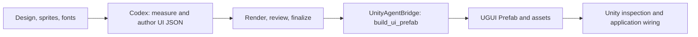

# Image to UI

[中文说明](README.zh-CN.md) · [Complete workflow](#complete-workflow) · [Unity command reference](Unity/README.md)

Use Codex to turn a UI design and sliced assets into reviewed `ui_structure.json`,
then assemble a Unity UGUI Prefab through UnityAgentBridge. Analysis, validation,
and export run as one continuous task.

The Prefab uses native UGUI components and generated assets. All declared states
are preserved as visibility branches, with only the current state active.
Developers own application control; no custom runtime scripts are generated.

## Complete workflow

Give Codex the complete task: analyze the design, generate and review the
structure, then use UnityAgentBridge to assemble a Prefab. Finish by inspecting
the Unity result and wiring application behavior.



### 1. Prepare the environment and install the Unity packages

Prepare Git, Python 3.10+, and a target Unity 2022.3+ project. Clone the
repository into your preferred working directory:

```bash
git clone https://github.com/XuToWei/Image-To-UI.git
```

Codex reads the skill, scripts, and examples from this checkout.
Install the Unity packages from GitHub as below.

The analysis scripts need Pillow and NumPy:

```bash
python -m pip install pillow numpy
```

On Windows, `py` can replace `python`.

Ensure Git is available to Unity. In the target project's Package Manager,
use **Add package from git URL**, in order:

1. `https://github.com/XuToWei/UnityAgentBridge.git?path=Unity`
2. `https://github.com/XuToWei/Image-To-UI.git?path=Unity`

Both packages place `package.json` in the `Unity/` subdirectory, so the UPM
URLs need `?path=Unity`. If Bridge is already installed, add only the second
package. Alternatively,
merge these entries into the project's `Packages/manifest.json`, retaining
its other dependencies:

```json
{
  "dependencies": {
    "me.xw.unityagentbridge": "https://github.com/XuToWei/UnityAgentBridge.git?path=Unity",
    "me.xw.imagetoui": "https://github.com/XuToWei/Image-To-UI.git?path=Unity"
  }
}
```

Wait for compilation with no Console errors. Stay in Edit Mode, open
**Window > Agent Bridge**, enable the host, and ensure `build_ui_prefab`
is enabled in the `Prefab` group. Keep the target project open.

### 2. Identify this run's inputs and outputs

Open this repository in Codex and explicitly use its
[`image-to-ui/SKILL.md`](image-to-ui/SKILL.md). The following file paths are
relative to the repository root:

| Item | Path |
| --- | --- |
| Design | `test/source/design/emberfall-ui-mockup.png` |
| Sprite root | `test/source/sprites` |
| Fresh analysis output | `test/output-local` |
| JSON to be generated | `test/output-local/ui_structure.json` |
| Unity project | Supply its absolute path, containing `Assets/` and `Packages/`. |
| Prefab output | `Assets/Generated/EmberfallMainUI.prefab` inside that Unity project. |

Use a separate fresh output directory for each new design. The checked-in
`test/output` is an existing example; this workflow consistently uses
`test/output-local`, including the JSON passed to Unity.

Provide intended fonts, alternate-state designs, scroll extents, and adaptation
requirements when available. Document inferred behavior and unavailable artwork
or fonts as uncertainties or approximations.
Use a native-resolution PNG/JPG design and preserve sprite-relative paths.
Optional Unity `.png.meta` borders and TTF/OTF fonts help preserve the intended
appearance in the exported Prefab.

### 3. Give Codex the complete task

After installing the packages, copy this request and fill in the Unity project
path. Codex runs the subsequent analysis, validation, and export stages; the
commands below explain the process and help with troubleshooting.

```text
Use this repository's image-to-ui/SKILL.md to complete the workflow
from the design image to a Unity Prefab.

Design: test/source/design/emberfall-ui-mockup.png
Sprite root: test/source/sprites
Fresh analysis output: test/output-local
Target Unity project: <absolute Unity project path>
Prefab output: Assets/Generated/EmberfallMainUI.prefab

Read the installed UnityAgentBridge AGENT.md and discover build_ui_prefab
with list_commands before starting the reconstruction.

Run prepare, measure the design, and author ui_structure.json.
Represent hierarchy, anchors/responsive constraints, states, progress bars,
and scroll regions. Iterate with check and inspect the reconstruction.
Use measure, target, and component preview where needed.
Complete element and applicable component reviews, run finalize, and verify
that this run's completion_report.json has complete: true.

Then call build_ui_prefab through UnityAgentBridge using the new
ui_structure.json from this run and the sprite root above.
Assemble native UGUI objects and resources. Generate all declared states as
visibility branches, with only the current state initially active.
Leave application control to developers and add no custom runtime scripts.
If the destination already exists, preserve it and report the conflict unless
I have explicitly requested overwrite.

Confirm that the Prefab loads in Unity, inspect resource references and state
branches, and report the JSON, comparison, Prefab, and resource directory paths,
including warnings, approximations, and verification results.
```

### 4. Codex measures the design and authors JSON

From the repository directory, Codex starts with:

```bash
python -B image-to-ui/scripts/workflow.py prepare --design test/source/design/emberfall-ui-mockup.png --assets test/source/sprites --output test/output-local
```

This generates the grid, asset inventory, and contact sheets. Codex uses them
to identify layers, measure parent-relative geometry, select sprites/fonts,
and write `test/output-local/ui_structure.json`. Small details can be
inspected with pixel-preserving `measure` crops.

Every node carries an anchor; `responsive` describes actual size constraints.
Use `state`, `progress`, and `scroll` for the corresponding components.
See the [schema](image-to-ui/references/schema.md) and
[component guide](image-to-ui/references/components.md) for their contracts.

### 5. Codex validates, reviews, and finalizes the analysis

After authoring or editing JSON:

```bash
python -B image-to-ui/scripts/workflow.py check --output test/output-local
```

Codex inspects `comparison.png`, element boxes, and audit reports, then
corrects geometry, assets, text, and layers. Use `target` for ambiguous areas
and `preview` for declared states, progress, scroll positions, and size
constraints. Record component findings in `component_review.md`.

After the latest successful check, write `alignment_review.md` with the
current review binding and run:

```bash
python -B image-to-ui/scripts/workflow.py finalize --output test/output-local
```

`"complete": true` in `completion_report.json` completes the native-design
analysis stage. Continue with the Unity export; that flag does not certify
that a Unity asset has been generated or inspected.

### 6. Codex generates the Prefab through Bridge

Call `build_ui_prefab` using the installed command schema. Its input is the
JSON just generated and reviewed in this run. Codex replaces `<repo>` with
the absolute repository path before calling Unity:

```json
{
  "command": "build_ui_prefab",
  "params": {
    "structurePath": "<repo>/test/output-local/ui_structure.json",
    "assetsPath": "<repo>/test/source/sprites",
    "prefabPath": "Assets/Generated/EmberfallMainUI.prefab"
  }
}
```

This is the command/params portion. Codex follows the installed Bridge's
`AGENT.md` for the envelope version, fresh id, publication, and response ack.
Use explicit `overwrite: true` when replacing an existing asset; use `fontMap`
for differing font paths. See the [Unity command reference](Unity/README.md#生成-prefab).

Unity assembles native UGUI objects, copies referenced sprites and fonts into
generated assets, and saves the Prefab. Declared states become
`States/<state>/Content` branches; only the current state starts active.
No custom runtime scripts are added.

Codex reads the returned `prefabPath`, `guid`, `resourceFolder`,
`stateObjects`, and `warnings`, confirms the asset loads, and reports any
remaining issues.

### 7. Inspect and use the Prefab in Unity

Open the generated asset in the Project window. Inspect layout, text, images,
and clipping at the design resolution and intended Game View sizes. Unity
font metrics can differ from Python previews. For corrections, update JSON
and repeat `check → review → finalize → build_ui_prefab`.

Drag the Prefab into the scene. It includes Canvas, CanvasScaler, and
GraphicRaycaster and is normally used as a scene root. Keep the returned
resource directory because the Prefab references those assets.

Developers switch state GameObjects with their active checkbox or `SetActive`
and wire button actions, progress updates, and application data. Pointer and
scroll input require an EventSystem with the project's appropriate input module.

Deliver the current JSON, comparison/review artifacts, Unity Prefab, generated
resources, and warnings/approximations. The complete Prefab task includes both
the analysis stage and Unity generation/inspection.

For an existing usable JSON, start at step 6. Installation details, font
mapping, and troubleshooting remain in the [Unity exporter reference](Unity/README.md).

## Output artifacts

| Artifact | Purpose |
| --- | --- |
| `ui_structure.json` | Engine-oriented UI hierarchy, anchors, geometry, text, and asset references. |
| `reconstruction.png` | Rendered result from the current structure. |
| `comparison.png` | Gridded design and reconstruction shown side by side. |
| `all_elements.png` / `all_elements_legend.json` | Overview of resolved element bounds, paths, and explicit list roles. |
| `target_*.png` / `target_*_legend.json` | Optional focused evidence for crowded regions. |
| `render_trace.json` | Resolved bboxes, visible pixels, fonts, layers, and render details. |
| `validate_report.json` / `visual_audit.json` | Structural and rendered-output diagnostics. |
| `alignment_review.md` | Human/AI review record for every foreground element. |
| `completion_report.json` | Native-design analysis completion, coverage, warnings, and approximations. |
| `workflow_state.json` | Input snapshots, revisions, checks, and resumable workflow state. |
| `previews/` / `component_review.md` | Alternate size/state/progress/scroll scenarios and their review, separate from native completion. |
| `measurements/` | Optional local design crops, pixel rulers, and crop/zoom mappings. |
| `assets/` and `design_grid.*` | Asset inventories, contact sheets, and grid measurements. |
| Target `.prefab` inside the Unity project | The final editable UGUI Prefab. |
| Bridge result: `resourceFolder` | Copied images/fonts and native Sprite assets referenced by the Prefab. |
| Bridge result: `stateObjects` / `warnings` | Actual state hierarchy paths, initial visibility, and import warnings. |

## Example: Emberfall HUD

This repository includes a complete example:

- Design: [`test/source/design/emberfall-ui-mockup.png`](test/source/design/emberfall-ui-mockup.png)
- Sliced sprites: [`test/source/sprites/`](test/source/sprites/)
- Final structure: [`test/output/ui_structure.json`](test/output/ui_structure.json)
- Completion report: [`test/output/completion_report.json`](test/output/completion_report.json)

[](test/output/comparison.png)

The checked-in run reconstructs a `1672 × 941` HUD with:

- 71 structured elements;
- 71/71 nodes with required anchor alignment metadata;
- 42 sprite references;
- 5 row/column layouts;
- 1 explicitly identified quest list with 2 list items;
- 70/70 reviewed element paths;
- zero validation or visual-audit warnings.

The mockup also contains artwork that was not supplied as a sliced sprite.
Those limits—such as the hero/portrait layer and font substitutions—are
recorded explicitly in `metadata.approximations` instead of being hidden.

The final review used focused evidence to correct the lower-right
[`ENTER` button](test/output/target_root_enter_button.png) and both QUEST row
backgrounds ([fire](test/output/target_root_quest_panel_quest_list_fire_quest_background.png),
[frost](test/output/target_root_quest_panel_quest_list_frost_quest_background.png)).

## Highlights

- Grid-based measurement at the design's native resolution, with optional
  pixel-preserving local crops and absolute-pixel rulers.
- Transparent sprite padding and alpha-core bounds for more accurate placement.
- Recursive PNG/JPG sprite inventory with duplicate-name detection and optional
  Unity `.png.meta` border support.
- Structured containers, rows, columns, images, text, generated rectangles, and
  overlays.
- Linear progress bars with numeric ranges, four fill directions, and label binding.
- State variants, clipped scroll viewports, responsive edge constraints, and safe areas.
- Separate previews for canvas size, state, progress value, and scroll offset.
- Required nine-position anchor alignment metadata on every structure node,
  with a migration tool for older JSON.
- Opt-in `list` / `listItem` roles chosen from explicit context or holistic
  visual semantics, then carried into element annotation legends.
- Nine-slice rendering, font tracing, tint, opacity, and hue-shift support.
- Strict structure validation plus visual-audit reports.
- Side-by-side comparison, element bounding boxes, and focused recheck images.
- Resumable workflow state and a final `completion_report.json`.

## Repository layout

```text
image-to-ui/
  SKILL.md
  agents/openai.yaml
  references/
  scripts/
Unity/
  package.json
  Editor/
  Tests/
test/
  source/
    design/
    sprites/
  output/
README.md
README.zh-CN.md
```

## License

[MIT](LICENSE)
