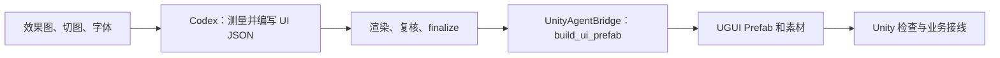

# Image to UI

[English](README.md) · [完整运行流程](#完整运行流程) · [Unity 命令参考](Unity/README.md)

使用 Codex 将 UI 效果图和切图转换为经过复核的 `ui_structure.json`，再通过
UnityAgentBridge 组装成 Unity UGUI Prefab。分析、校验与导入在同一项任务中连续完成。

生成的 Prefab 使用原生 UGUI 组件和素材。不同状态完整保存在显隐分组中，
默认只激活当前状态；业务控制由开发者实现，没有自定义运行时脚本依赖。

## 完整运行流程

从效果图开始，把下面整条任务交给 Codex：生成结构、校验复核，再通过
UnityAgentBridge 组装 Prefab。开发者最后在 Unity 中检查效果并接入业务。



### 1. 准备环境并安装 Unity 包

准备 Git、Python 3.10+ 和目标 Unity 2022.3+ 工程。在希望保存仓库的目录执行：

```bash
git clone https://github.com/XuToWei/Image-To-UI.git
```

Codex 从克隆后的仓库读取 skill、脚本和示例。Unity 包使用下面的 GitHub 地址安装。

Python 分析脚本依赖 Pillow 和 NumPy，可先安装：

```bash
python -m pip install pillow numpy
```

Windows 上也可使用 `py` 代替 `python`。

确保 Unity 能调用 Git。在目标工程的 Package Manager 中选择
**Add package from git URL**，依次添加：

1. `https://github.com/XuToWei/UnityAgentBridge.git?path=Unity`
2. `https://github.com/XuToWei/Image-To-UI.git?path=Unity`

两个包的 `package.json` 都位于仓库的 `Unity/` 子目录，因此 UPM 地址需要
`?path=Unity`。已安装 Bridge 时只添加第二个包。也可将下面两项合并到工程的
`Packages/manifest.json`，保留其他依赖：

```json
{
  "dependencies": {
    "me.xw.unityagentbridge": "https://github.com/XuToWei/UnityAgentBridge.git?path=Unity",
    "me.xw.imagetoui": "https://github.com/XuToWei/Image-To-UI.git?path=Unity"
  }
}
```

等待编译结束且 Console 无编译错误。保持 Unity 在 Edit Mode，打开
**Window > Agent Bridge**，启用宿主，确认 `Prefab` 分组中的
`build_ui_prefab` 未被禁用。保持目标工程打开。

### 2. 确定本次输入和输出

在 Codex 中打开本仓库，明确告诉它使用仓库内的
[`image-to-ui/SKILL.md`](image-to-ui/SKILL.md)。下面的文件路径相对于仓库根目录：

| 项目 | 路径 |
| --- | --- |
| 效果图 | `test/source/design/emberfall-ui-mockup.png` |
| 切图根目录 | `test/source/sprites` |
| 本次分析输出目录 | `test/output-local` |
| 将要生成的 JSON | `test/output-local/ui_structure.json` |
| Unity 工程 | 填写实际工程绝对路径，目录中应有 `Assets/` 和 `Packages/`。 |
| Prefab 输出 | 该 Unity 工程中的 `Assets/Generated/EmberfallMainUI.prefab` |

每个新设计使用独立的新输出目录。仓库的 `test/output` 是已有案例，当前流程统一使用
`test/output-local`，后面的 Unity 命令也读取这里的新 JSON。

如有目标字体、其他状态的效果图、滚动范围或适配要求，一并提供。
单张图不能确定的行为应注明推断依据，缺少的素材与字体应记录为近似项。
效果图使用原始分辨率的 PNG/JPG；切图保留相对目录，可附 Unity `.png.meta`
边框数据，供 Unity 使用的字体优先提供 TTF/OTF。

### 3. 将完整任务交给 Codex

安装好包后，复制下面的任务描述，填写 Unity 工程路径即可开始。
Codex 会连续执行后面的分析、校验和导入步骤，命令示例用于了解或排查过程。

```text
使用本仓库的 image-to-ui/SKILL.md，完成从效果图到 Unity Prefab 的完整流程。

效果图：test/source/design/emberfall-ui-mockup.png
切图根目录：test/source/sprites
本次全新分析输出目录：test/output-local
目标 Unity 工程：<填写 Unity 工程绝对路径>
Prefab 输出：Assets/Generated/EmberfallMainUI.prefab

先读取目标工程中已安装 UnityAgentBridge 的 AGENT.md，通过 list_commands
确认 build_ui_prefab 可用。

按 skill 执行 prepare，测量效果图，编写 ui_structure.json。
处理层级、原生锚点/适配约束、状态变体、进度条和滚动区域。
反复 check 并查看重建对比图；必要时使用 measure、target 和组件 preview。
完成逐元素审查和适用的组件场景复核，执行 finalize，
确认本次 completion_report.json 的 complete 为 true。

接着通过 UnityAgentBridge 调用 build_ui_prefab，
structurePath 必须指向本次输出目录的 ui_structure.json，
assetsPath 使用上述切图根目录。
只组装原生 UGUI 组件和资源，将所有已声明状态拼成显隐分组，
默认激活当前状态，其余隐藏；业务控制由开发者实现，不添加自定义 Runtime 脚本。
如目标已存在，保留现有文件并报告路径冲突，除非我已明确要求覆盖。

在 Unity 中确认生成的 Prefab 可加载，检查资源引用和状态分组。
最后报告 JSON、对比图、Prefab 和资源目录路径，以及所有警告、近似项与检查结果。
```

### 4. Codex 测量效果图并生成 JSON

Codex 先在本仓库目录执行：

```bash
python -B image-to-ui/scripts/workflow.py prepare --design test/source/design/emberfall-ui-mockup.png --assets test/source/sprites --output test/output-local
```

`prepare` 生成测量网格、素材清单和联系表。Codex 根据这些证据识别视觉层级，
测量父子坐标、选择切图与字体，并编写
`test/output-local/ui_structure.json`。小图标和细边框可用 `measure` 局部放大。

每个节点包含锚点；实际尺寸适配使用 `responsive`。需要显隐切换的元素声明
`state`，进度条和滚动区分别声明 `progress`、`scroll`。
具体格式见[结构说明](image-to-ui/references/schema.md)和
[组件说明](image-to-ui/references/components.md)。

### 5. Codex 校验、复核并完成分析

编写或修改 JSON 后执行：

```bash
python -B image-to-ui/scripts/workflow.py check --output test/output-local
```

Codex 查看 `comparison.png`、元素包围框和审计报告，修正位置、素材、文字及层级。
拥挤区域用 `target` 复核；有状态、进度、滚动或适配声明时，用 `preview`
检查相应场景，并记录在 `component_review.md`。

完成最新一轮检查后，Codex 写入带当前 review binding 的
`alignment_review.md`，然后执行：

```bash
python -B image-to-ui/scripts/workflow.py finalize --output test/output-local
```

`completion_report.json` 中的 `"complete": true` 表示原图分析阶段完成。
接下来继续生成 Unity Prefab。该标记不代表已经生成或检查了 Unity 资产。

### 6. Codex 通过 Bridge 生成 Prefab

Codex 按已发现的 Bridge schema 调用 `build_ui_prefab`。这里接收的 JSON
正是上一步生成并复核的文件。`<repo>` 在调用前由 Codex 替换为仓库的绝对路径：

```json
{
  "command": "build_ui_prefab",
  "params": {
    "structurePath": "<repo>/test/output-local/ui_structure.json",
    "assetsPath": "<repo>/test/source/sprites",
    "prefabPath": "Assets/Generated/EmberfallMainUI.prefab"
  }
}
```

这是 command/params 部分；版本、全新 id、请求发布和响应 ack 由 Codex 按
Bridge 的 `AGENT.md` 处理。需要覆盖已有目标时显式传 `overwrite: true`；
字体路径不同可使用 `fontMap`，详见 [Unity 参数参考](Unity/README.md#生成-prefab)。

Unity 在编辑器中创建原生 UGUI 层级，将引用的图片和字体复制到生成资源目录，
保存 Prefab。各状态生成 `States/<状态>/Content` 分支，当前状态激活，其余关闭。
生成物不附加自定义运行时脚本。

Codex 读取返回的 `prefabPath`、`guid`、`resourceFolder`、
`stateObjects` 和 `warnings`，确认资产可加载并报告需要处理的问题。

### 7. 在 Unity 中检查和使用

在 Project 窗口打开生成的 Prefab，检查原始设计尺寸与目标 Game View 尺寸下的
布局、文字、图片和裁剪。Unity 文字度量可能与 Python 预览不同；若需要修正，
让 Codex 更新 JSON，重新完成 `check → review → finalize → build_ui_prefab`。

将 Prefab 拖入场景即可使用，它自带 Canvas、CanvasScaler 和 GraphicRaycaster，
通常作为场景根对象。保留返回的资源目录，Prefab 会引用其中的素材。

需要另一种外观时，开发者切换对应状态分组的 GameObject 激活状态或调用
`SetActive`。按钮事件、进度更新和业务数据由项目接线；点击、拖拽和滚轮需要
场景中的 EventSystem 及匹配的输入模块。

整条流程的交付包括本次 JSON、对比与审查产物、Unity Prefab、生成素材，以及
警告和近似项说明。只有完成分析和 Unity 生成/检查，才算完成这项 Prefab 任务。

如果已有可用 JSON，可以从第 6 步开始。安装细节、字体映射和常见问题见
[Unity 导入器参考](Unity/README.md)。

## 输出产物

| 产物 | 用途 |
| --- | --- |
| `ui_structure.json` | 面向引擎的 UI 层级、锚点、几何信息、文本和资源引用。 |
| `reconstruction.png` | 根据当前结构渲染的重建结果。 |
| `comparison.png` | 带网格的效果图与重建图左右对比。 |
| `all_elements.png` / `all_elements_legend.json` | 所有元素的解析后包围框、路径和显式列表角色。 |
| `target_*.png` / `target_*_legend.json` | 针对拥挤区域生成的可选局部证据。 |
| `render_trace.json` | 解析后的包围框、可见像素、字体、层级和渲染细节。 |
| `validate_report.json` / `visual_audit.json` | 结构与渲染结果诊断报告。 |
| `alignment_review.md` | 每个前景元素的人工/AI 审查记录。 |
| `completion_report.json` | 原图分析阶段的完成状态、覆盖率、警告和近似项汇总。 |
| `workflow_state.json` | 输入快照、结构版本、检查次数和可恢复状态。 |
| `previews/` / `component_review.md` | 不同尺寸、状态、进度和滚动位置的预览与审查；独立于原图完成检查。 |
| `measurements/` | 可选的局部放大图、像素标尺与裁剪/缩放坐标映射。 |
| `assets/` 与 `design_grid.*` | 资源清单、联系表和网格测量数据。 |
| Unity 工程中的目标 `.prefab` | 最终生成的可编辑 UGUI Prefab。 |
| Bridge 返回的 `resourceFolder` | Prefab 引用的图片、字体和原生 Sprite 资源目录。 |
| Bridge 返回的 `stateObjects` / `warnings` | 实际状态分组路径、初始显隐和导入警告。 |

## Emberfall HUD 完整案例

仓库内包含一套完整案例：

- 效果图：[`test/source/design/emberfall-ui-mockup.png`](test/source/design/emberfall-ui-mockup.png)
- 切图目录：[`test/source/sprites/`](test/source/sprites/)
- 最终结构：[`test/output/ui_structure.json`](test/output/ui_structure.json)
- 完成报告：[`test/output/completion_report.json`](test/output/completion_report.json)

[](test/output/comparison.png)

当前案例在 `1672 × 941` 画布上包含：

- 71 个结构化元素；
- 71/71 个节点包含必填锚点对齐信息；
- 42 个切图引用；
- 5 个行/列布局；
- 1 个显式任务列表及 2 个列表项；
- 70/70 个元素路径完成审查；
- 结构校验和视觉审计均为零警告。

效果图中也包含未提供独立切图的内容。角色、头像和字体替代等限制会明确
记录在 `metadata.approximations`，而不是隐藏在结果或说明文字中。

最终审查还通过局部证据修正了右下角
[`ENTER` 按钮](test/output/target_root_enter_button.png)，以及两条 QUEST
背景（[火焰任务](test/output/target_root_quest_panel_quest_list_fire_quest_background.png)、
[冰霜任务](test/output/target_root_quest_panel_quest_list_frost_quest_background.png)）。

## 主要能力

- 在效果图原始分辨率上测量，支持保留原始像素的局部放大与绝对坐标标尺。
- 区分切图透明边距、完整可见范围与较不透明的主体范围，减少尺寸和居中误差。
- 递归盘点 PNG/JPG 切图，检测重名资源，并支持可选的 Unity
  `.png.meta` 边框数据。
- 支持容器、行列布局、图片、文本、程序化矩形和遮罩层。
- 支持线性进度条的数值、四向填充裁剪及文字绑定。
- 支持状态变体、滚动视口裁剪、自适应边距/拉伸约束和安全区。
- 可按界面尺寸、控件状态、进度值、滚动偏移渲染独立预览。
- 每个结构节点都包含必填的九宫格锚点对齐信息，并提供旧 JSON 补齐工具。
- 结合明确上下文与整体视觉语义标记 `list` / `listItem`，并写入标注清单。
- 支持九宫格、字体追踪、染色、透明度与色相偏移。
- 严格的 JSON 结构校验和渲染结果视觉审计。
- 生成左右对比图、全元素包围框和局部复核图。
- 可恢复的工作流状态与最终 `completion_report.json`。

## 仓库结构

```text
image-to-ui/
  SKILL.md
  agents/openai.yaml
  references/
  scripts/
Unity/
  package.json
  Editor/
  Tests/
test/
  source/
    design/
    sprites/
  output/
README.md
README.zh-CN.md
```

## 许可证

[MIT](LICENSE)
