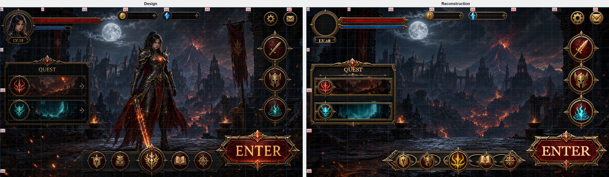

# Image to UI

[English](README.md)

将一张 UI 效果图和对应切图转换为经过验证、可审查的
`ui_structure.json`，适用于 Unity/Cocos 风格的游戏 UI。

Image to UI 不只是提取一组大概坐标。仓库内的 Codex skill 会盘点切图、
为原始分辨率效果图叠加测量网格、构建父子相对的 UI 层级、渲染重建结果、
执行结构与视觉审计，并要求逐元素审查通过后才将任务标记为完成。

## 主要能力

- 在效果图原始分辨率上进行网格化测量。
- 递归盘点 PNG/JPG 切图，检测重名资源，并支持可选的 Unity
  `.png.meta` 边框数据。
- 支持容器、行列布局、图片、文本、程序化矩形和遮罩层。
- 每个结构节点都包含必填的九宫格锚点对齐信息，并提供旧 JSON 补齐工具。
- 结合明确上下文与整体视觉语义标记 `list` / `listItem`，并写入标注清单。
- 支持九宫格、字体追踪、染色、透明度与色相偏移。
- 严格的 JSON 结构校验和渲染结果视觉审计。
- 生成左右对比图、全元素包围框和局部复核图。
- 可恢复的工作流状态与最终 `completion_report.json`。

## Emberfall HUD 完整案例

仓库内包含一套完整案例：

- 效果图：[`test/source/design/emberfall-ui-mockup.png`](test/source/design/emberfall-ui-mockup.png)
- 切图目录：[`test/source/sprites/`](test/source/sprites/)
- 最终结构：[`test/output/ui_structure.json`](test/output/ui_structure.json)
- 完成报告：[`test/output/completion_report.json`](test/output/completion_report.json)

[](test/output/comparison.png)

当前案例在 `1672 × 941` 画布上包含：

- 71 个结构化元素；
- 71/71 个节点包含必填锚点对齐信息；
- 42 个切图引用；
- 5 个行/列布局；
- 1 个显式任务列表及 2 个列表项；
- 70/70 个元素路径完成审查；
- 结构校验和视觉审计均为零警告。

效果图中也包含未提供独立切图的内容。角色、头像和字体替代等限制会明确
记录在 `metadata.approximations`，而不是隐藏在结果或说明文字中。

最终审查还通过局部证据修正了右下角
[`ENTER` 按钮](test/output/target_root_enter_button.png)，以及两条 QUEST
背景（[火焰任务](test/output/target_root_quest_panel_quest_list_fire_quest_background.png)、
[冰霜任务](test/output/target_root_quest_panel_quest_list_frost_quest_background.png)）。

## 使用 Codex 快速开始

克隆或在 Codex 中打开本仓库，然后让 Codex 使用 `image-to-ui/` 下的
skill。

仓库案例已经占用 `test/output`。重新运行或处理新效果图时，必须使用一个
全新的输出目录：

```text
使用本仓库中的 image-to-ui skill。
效果图为 test/source/design/emberfall-ui-mockup.png，切图位于
test/source/sprites。请将 UI 重建到 test/output-local，完成结构校验、
逐元素审查，并最终执行 finalize。
```

Codex 会按照 [`image-to-ui/SKILL.md`](image-to-ui/SKILL.md) 从准备阶段
推进到最终审查。

## 工作流命令

正常任务应由 skill 驱动。以下命令适合调试或单独检查某个阶段；Windows
可将 `python` 替换为 `py`。

### 1. 准备全新任务

```bash
python -B image-to-ui/scripts/workflow.py prepare --design test/source/design/emberfall-ui-mockup.png --assets test/source/sprites --output test/output-local
```

该命令会生成测量网格、资源清单、分组联系表和
`workflow_state.json`。

### 2. 编写 UI 结构

结合网格与资源清单创建 `test/output-local/ui_structure.json`。层级、
布局和坐标编写通常由 Codex skill 完成。每个节点都必须包含
`anchor.horizontal` 和 `anchor.vertical`。

已有结构可用以下命令补齐锚点，不会改变任何包围框坐标：

```bash
python -B image-to-ui/scripts/backfill_anchors.py --structure old.json --output upgraded.json
```

水平方向只允许 `left` / `center` / `right`，垂直方向只允许
`top` / `middle` / `bottom`。手工选择规则和原文件原子升级方式见
[结构说明](image-to-ui/references/schema.md#anchor-alignment)。

### 3. 校验并渲染

```bash
python -B image-to-ui/scripts/workflow.py check --output test/output-local
```

`check` 会校验 JSON，并重新生成重建图、渲染追踪、元素包围框、视觉审计和
左右对比图。

完整检查通过后，可以为拥挤或容易误判的区域生成局部证据：

```bash
python -B image-to-ui/scripts/workflow.py target --output test/output-local --element-path "root/quest_panel/quest_list"
```

### 4. 审查并完成

审查 `all_elements_legend.json` 中的每个路径，在
`alignment_review.md` 中写入最新 `check` 或 `target` 输出的 review
binding，然后运行：

```bash
python -B image-to-ui/scripts/workflow.py finalize --output test/output-local
```

只有当 `completion_report.json` 包含 `"complete": true` 时，任务才算
完成。

## 输出产物

| 产物 | 用途 |
| --- | --- |
| `ui_structure.json` | 面向引擎的 UI 层级、锚点、几何信息、文本和资源引用。 |
| `reconstruction.png` | 根据当前结构渲染的重建结果。 |
| `comparison.png` | 带网格的效果图与重建图左右对比。 |
| `all_elements.png` / `all_elements_legend.json` | 所有元素的解析后包围框、路径和显式列表角色。 |
| `target_*.png` / `target_*_legend.json` | 针对拥挤区域生成的可选局部证据。 |
| `render_trace.json` | 解析后的包围框、可见像素、字体、层级和渲染细节。 |
| `validate_report.json` / `visual_audit.json` | 结构与渲染结果诊断报告。 |
| `alignment_review.md` | 每个前景元素的人工/AI 审查记录。 |
| `completion_report.json` | 最终完成状态、覆盖率、警告和近似项汇总。 |
| `workflow_state.json` | 输入快照、结构版本、检查次数和可恢复状态。 |
| `assets/` 与 `design_grid.*` | 资源清单、联系表和网格测量数据。 |

## 输入要求

每个任务需要：

1. 一张原始分辨率的 PNG 或 JPG 效果图；
2. 一个 PNG/JPG 切图目录，可选附带 Unity metadata 和字体文件；
3. 一个专属于该效果图的全新输出目录。

为获得更好的重建效果，应尽量为每个前景视觉元素提供独立切图，让原子图标
保持自然宽高比，并随任务提供目标字体。所有有意替代和接受的审计例外都必须
写入结构 metadata。

## 仓库结构

```text
image-to-ui/
  SKILL.md
  agents/openai.yaml
  references/
  scripts/
test/
  source/
    design/
    sprites/
  output/
README.md
README.zh-CN.md
```

## 许可证

[MIT](LICENSE)
